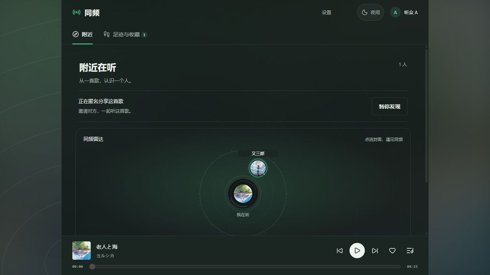
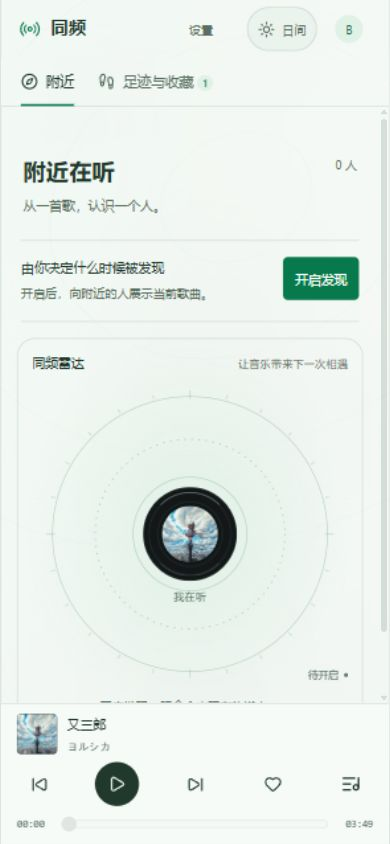
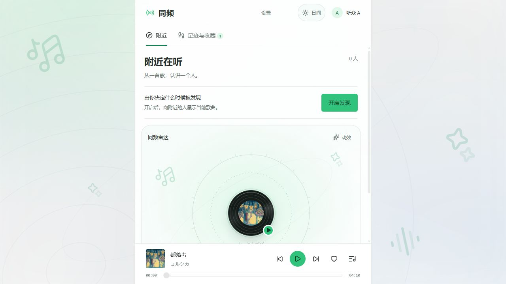
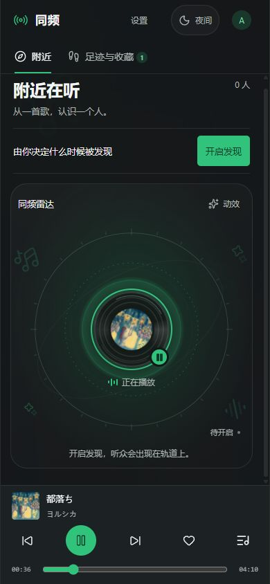

# 音乐应用 UI 重构

日期：2026-09-21。范围：附近、音乐足迹、回歌、当前播放栏与账号入口。

## 视觉与布局

- 日间采用浅灰白与音乐绿，夜间采用低亮度深灰绿；用当前歌曲封面的柔焦底色与疏朗曲线丰富背景，歌曲信息保持清晰。
- 应用使用完整可用高度，一处内容滚动；导航固定在上方，播放器固定在底部，账号和设置收进顶部菜单。
- 回歌按今天、昨天和日期分组；每条保留封面、歌名、歌手、时间和小未读标记。展开后仍可查看送出的歌曲并试听。
- 今日统计改为轻量文字，分类采用下划线导航；保留全部去重、已读和账号保存规则。
- 附近默认展示唱片轨道雷达：中心为当前歌曲，真人听众以封面出现在轨道；选中后连线并定位邀请入口。没有听众或未开启时仍展示唱片与轨道，不生成虚构节点。
- 320px / 390px 下无页面横向溢出，播放器五个操作均保留 44px 点击区域；插件以手机端为主，桌面内容最大宽度收至 600px。

## 参考与素材

- 参考 Bandcamp Discover 的音乐内容优先： https://blog.bandcamp.com/2023/12/12/discover-a-new-way-to-shop-on-bandcamp/
- 使用艺人/发行方官方页面提供的封面展示当前四首歌曲；来自幻燈、又三郎、老人と海及 NARUTO THE BEST 的封面。
- 文件、出处与权利说明见 `public/covers/SOURCES.md`。没有将官方封面标为免版权素材。
- 交互图标继续复用 lucide-react（ISC）与既有 Solar 素材，未引入新的图标依赖。
- 日夜外观参考 QQ 音乐官网的绿色强调色和音乐内容层次：https://y.qq.com/ 。背景复用现有封面，未新增第三方图片或依赖。

## 日间 / 夜间外观

- 封面、登录、附近、足迹、播放列表、通知和共听房间使用统一外观；顶栏日/月按钮切换，默认夜间。
- 使用已有 next-themes，偏好保存在本机 `resonance.appearance`，同源窗口同步、刷新保持；不绑定 A/B 账号，不修改播放或发现状态。
- 页面使用语义色彩变量；日间独立调整文字、边框、选中态及雷达轨道。唱片本身保留深色材质。装饰背景无交互、不播放动画，不拦截点击。
- 390px 顶栏保留独立的设置、外观和账号入口；外观按钮可通过键盘操作，名称明确提示切换目标。

## 验证

- 原客户端及恢复交互测试 19 项通过；TypeScript、改动文件 lint、生产构建通过。
- 浏览器验证封面实际加载、按日期显示、展开回歌、单条未读更新、试听、返回原分类及单播放器。
- 390×844 下页面尺寸等于视口，无外层双重滚动，五个播放器按钮均为 44×44px。
- 日夜切换、刷新保留、A/B 同源窗口同步已在浏览器验证；检查了登录、封面、足迹、播放列表及双人房间。390px 顶栏三入口互不重叠。

这次只调整布局和素材，没有改变登录账号、真人发送、自动回应、持久化或去重规则。

## PR 预览

以下是 2026-09-21 的历史外观截图；2026-09-24 的手机优先调整见下节。

桌面夜间（1280×720）与窄屏日间（390×844），使用本地 A/B 测试账号。

## 手机优先与唱片播放效果（2026-09-24）

- 背景新增 Solar 线条音符、星光和声纹，静态放置于画面边缘；使用本地 SVG mask 随日夜外观着色，出处和 CC BY 4.0 说明见 `public/assets/ambient/SOURCES.txt`，设置中保留来源入口。
- 收紧手机端标题、发现控制与卡片留白，中央唱片放大到 100–108px。听众节点外移，为中央播放按钮保留触摸空间；装饰素材不生成听众、不接收点击。
- 点中央唱片直接复用当前播放器。只有所展示曲目实际 `playing` 时唱片转动、光环扩散、装饰声纹起伏；发现开启、加载、暂停、结束和错误均不算正在播放。
- 装饰声纹为 CSS 反馈，不是音频频谱分析。动效 / 静态开关不影响声音；页面隐藏暂停装饰，尊重系统 `prefers-reduced-motion`。未引入第二个音频元素、Canvas 或额外动效库。
- 浏览器验证中央播放 / 暂停、动效开关、唯一音频元素、320×667 夜间及 390×844 日间布局。页面无横向溢出，播放器五个按钮均为 44×44px；短屏使用单一内容滚动。
- 客户端恢复与 UI 测试共 22 项通过，新增播放状态、曲目匹配、关闭动效和页面隐藏检查。本轮仍不代表手机真机、宿主容器或 iOS 验收。

## 配色与头像回应（2026-09-24）

- 参考 QQ 音乐官网的清爽白绿方向，采用 #31c27c 操作强调色，日间为中性白灰与少量薄荷绿，夜间为炭黑；正文和绿色文字独立控制对比度，降低封面背景的浑浊感。
- 专辑两侧显示“你 / TA”匿名头像，在线、离线状态各自对应本人。尚未接入官方个人头像，使用耳机 / 人像图标占位，不展示真实身份。
- 发出招呼时自己的头像轻摇，收到对方招呼时才摇动对方头像；喜欢歌曲使用一次轻弹。提示约 2.6 秒收起，不反复播放。送达回执不会触发对方的回应动画。
- 单人场景的对方动作沿用服务端延迟回信；按歌曲匹配，不让旧歌曲的消息影响新封面。进入页面不重播历史动作。
- “静态效果”同时控制头像及回应区，系统减少动态效果时不摇晃；保留简短的静态图标提示和原有文字播报。
- 客户端回归增至 24 项，覆盖发送方 / 接收方、错误歌曲、失败请求、送达回执、历史记录及动作结束。浏览器双端实测发招呼后双方对应头像动作，结束后移除提示。

## 本轮 PR 截图

2026-09-24，桌面日间及手机宽度夜间播放状态；均为本地测试账号。

